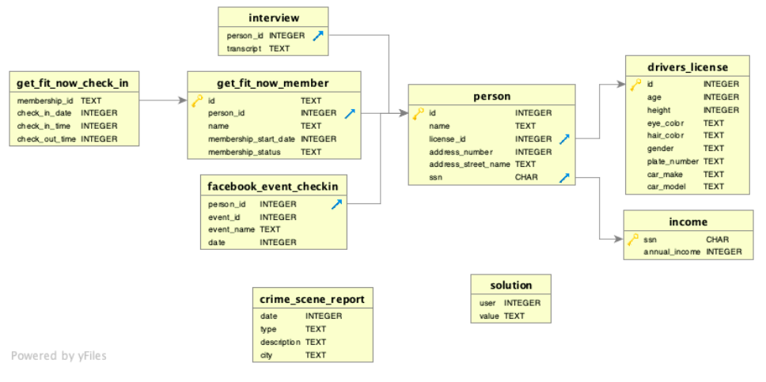
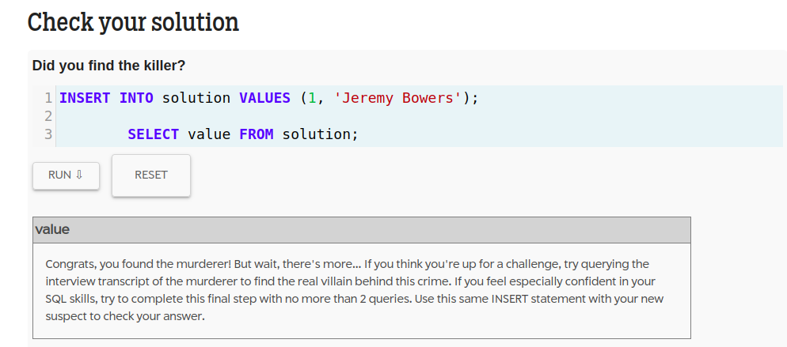
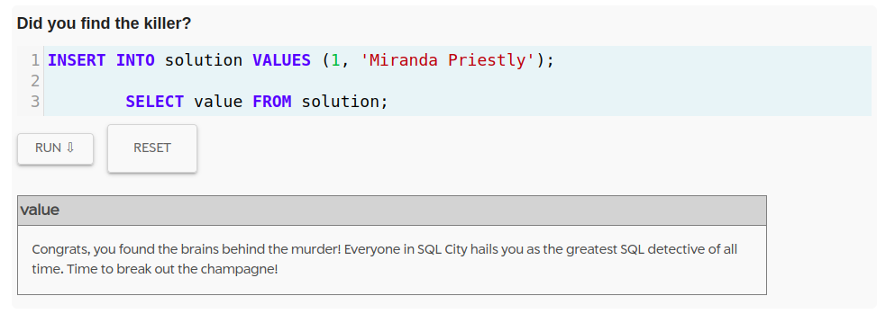

# coding-journal-2023

This is my coding journal for the year 2023. If you need to search for something specific, use `crtl + f` and enter the term in the search bar.

## Table of Contents

- [02/04/2023](#02-04-2023)
  - [02/04/2023 - Webpack Starter Project](#02-04-2023-webpack-starter-project)
- [02/17/2023](#02-17-2023)
  - [02/17/2023 - Sortable User Table Additional Requirements](#02-17-2023-sortable-user-table-additional-requirements)
  - [02/17/2023 - Vue Memory Game Additional Requirements](#02-17-2023-vue-memory-game-additional-requirements)
  - [02/17/2023 - React.js Real-Time Chat Application Requirements](#02-17-2023-reactjs-real-time-chat-application-requirements)
- [02/21/2023](#02-21-2023)
  - [02/21/2023 - SQL Murder Mystery](#02-21-2023-sql-murder-mystery)
  - [SQL Murder Mystery 1 - Collect Crime Scene Report](#sql-murder-mystery-1---collect-crime-scene-report)
  - [SQL Murder Mystery 2 - Collect Eye Witness Interviews](#sql-murder-mystery-2---collect-eye-witness-interviews)
  - [SQL Murder Mystery 3 -  First Eye Witness Interview Transcript](#sql-murder-mystery-3---first-eye-witness-interview-transcript)
  - [SQL Murder Mystery 4 - Second Eye Witness Interview Transcript](#sql-murder-mystery-4---second-eye-witness-interview-transcript)
  - [SQL Murder Mystery 5 - Determining the Suspect](#sql-murder-mystery-5---determining-the-suspect)
  - [SQL Murder Mystery 6 - The Realization](#sql-murder-mystery-6---the-realization)
  - [SQL Murder Mystery 7 - The Plot Twist](#sql-murder-mystery-7---the-plot-twist)

## 02-04-2023

### ***02-04-2023 Webpack Starter Project***

I needed to determine the SASS folder structure and how I am organizing my styling. I found the following files during my research phase

- [https://gist.github.com/AdamMarsden/7b85e8d5bdb5bef969a0](https://gist.github.com/AdamMarsden/7b85e8d5bdb5bef969a0)
- [https://itnext.io/structuring-your-sass-projects-c8d41fa55ed4](https://itnext.io/structuring-your-sass-projects-c8d41fa55ed4)
- [https://github.com/fransyrcc/starter-html-sass-js-webpack](https://github.com/fransyrcc/starter-html-sass-js-webpack)

For the next phase of my research, I wanted to have a clear variable naming structure. I found this article that I think I will use this strategy to ensure a clear separation from base/layout styling 

- [https://sandstorm.de/de/blog/post/bem-sass-scss-variable-naming.html](https://sandstorm.de/de/blog/post/bem-sass-scss-variable-naming.html)

Finally, I wanted a clear guide to properly import Google fonts in my sass files. I found this article in my research phase

- [https://www.developerdrive.com/how-to-easily-use-google-fonts-with-sass/](https://www.developerdrive.com/how-to-easily-use-google-fonts-with-sass/)

[back to top](#coding-journal-2023)

## 02-17-2023

### ***02-17-2023 Sortable User Table Additional Requirements***

- Add pagination capability
    - Add pagination options to the HTML table, allowing users to navigate through large sets of data easily.
    - Implement pagination on the client side by limiting the number of rows displayed per page and adding navigation controls (e.g., next, previous, first, and last).
    - When the user selects a new page, the project should call the API to retrieve the next set of data and update the HTML table accordingly.
    - Test the pagination feature thoroughly to ensure that it works correctly, even when there are large amounts of data.
    - To optimize performance, consider using server-side pagination to reduce the amount of data sent to the client.
- convert to webpack starter so scss/js can be utilized
- Add jest/mocha build unit tests
    - Install a unit testing framework such as Jest or Mocha.
    - Write test cases to ensure that the API is called correctly and the data is parsed and displayed correctly in the HTML table.
    - Test cases should cover different scenarios, such as successful and failed API calls, empty or invalid responses, and data with different properties.
    - Use test-driven development (TDD) approach to write code that passes the tests and refactor as necessary.
  
[back to top](#coding-journal-2023)

### ***02-17-2023 Vue Memory Game Additional Requirements***

- Appealing Animations: The user should be able to enjoy watching the background animations, which should be appealing to the eye and appropriate for the game's theme.
  - Smooth Performance: The animations should not affect the performance of the game or cause any lags or delays while playing.
- Customization: The user should have the ability to customize the background animations, such as changing the colors, speed, and style of the animations.
  - Toggle the button for Light/Dark mode
  - Toggle button for cowboy/forest theme
- Show dial to speed up/slow down tumbleweed/animal animation
- Button to disable animations
  - Would just show a static animal in the background for the forest theme (fade-in)
  - Would show tumbleweed in the background for the cowboy theme (fade-in)

[back to top](#coding-journal-2023)
  
### ***02-17-2023 React.js Real-Time Chat Application Requirements***

1. User Login and Registration: Users should be able to create an account and log in to the app with their email or social media account.
2. User Profiles: Users should be able to view their profile and update their profile picture, name, and other details.
3. Real-time Text Chat: The app should allow users to communicate with one another via real-time text chat, with the ability to send and receive messages instantly.
4. Audio and Video Calls: The app should allow users to make audio and video calls with other users, with the ability to switch between audio and video during the call.
5. Group Chats: Users should be able to create and join group chats, where multiple users can communicate with one another.
6. Push Notifications: The app should notify users of new messages, calls, and other events with push notifications.
7. Encryption and Privacy: The app should use end-to-end encryption for all messages and calls to ensure the privacy and security of user data.
8. User Blocking: Users should be able to block other users and report abusive or inappropriate behavior.
9. User Status: Users should be able to update their status, indicating whether they are online, offline, or away.
10. User Search: Users should be able to search for other users by name or email address to find and connect with them.

[back to top](#coding-journal-2023)

## 02-21-2023

### 02-21-2023 SQL Murder Mystery

[SQL Murder Mystery](https://mystery.knightlab.com/)


***SPOILERS AHEAD. Feel free to try solving it before reading***

A fun activity to use some SQL skills to help solve a murder mystery. Here is how it begins:

A crime has taken place and the detective needs your help. The detective gave you the crime scene report, but you somehow lost it. You vaguely remember that the crime was a **​murder**​ that occurred sometime on **​Jan.15, 2018**​ and that it took place in **​SQL City**​. Start by retrieving the corresponding crime scene report from the police department’s database.


A database schema is provided

<details>
  <summary><strong>Click Here</strong> to view the database diagram</summary>

  
</details>
<br />

#### ***SQL Murder Mystery 1 - Collect Crime Scene Report***

Our first step should be collecting the data from the `crime_scene_report` table. Since I want all the columns from the table, I will use the `*` catchall symbol. I will also use the above bolded information to narrow down for the `type` (murder), `city` (SQL City), and `date` (20180115)

```sql
SELECT *
FROM crime_scene_report
WHERE type = 'murder'
AND city = 'SQL City'
AND date = '20180115';
```

This query returns back 1 result:

| date     | type   | description | city |
|----------|--------|-------------|------|
| 20180115 | murder | Security footage shows that there were 2 witnesses.The first witness lives at the last house on "Northwestern Dr". The second witness, named Annabel, lives somewhere on "Franklin Ave". | SQL City |

#### ***SQL Murder Mystery 2 - Collect Eye Witness Interviews***

We now have 2 leads

1. A witness named Annabel on "Franklin Ave"
2. A witness who lived in the last house of "Northwestern Dr"

We can search the `person` database for the `person_id`, then use that foreign key to pull up any information from the `interview` table

#### ***SQL Murder Mystery 3 -  First Eye Witness Interview Transcript***

So for the first witness, I only have a first name and street address, so I used a wildcard (`%`) operator to match any that partially matches and included the street address

```sql
SELECT *
FROM person
WHERE name LIKE '%Annabel%'
AND address_street_name = 'Franklin Ave';

```

This returned back 1 result:

| id | name | license_id | address_number | address_street_name | ssn |
| -- | ---- | ---------- | -------------- | ------------------- | --- |
| 16371 | Annabel Miller | 490173 | 103 | Franklin Ave | 318771143 |


Now that we have a `person_id` I can collect the info from the `interview` table from Annabel Miller

```sql
SELECT *
FROM interview
WHERE person_id = 16371;
```

The query came back with 1 result

| person_id | transcript |
| --------- | ---------- |
| 16371     | I saw the murder happen, and I recognized the killer from my gym when I was working out last week on January the 9th. |

#### ***SQL Murder Mystery 4 - Second Eye Witness Interview Transcript***

As stated above. the second witness lived in the last house of "Northwestern Dr". So I need to list all the houses on "Northwestern Dr" and order them by `address_number` the highest number will be the last house.

```sql
SELECT *
FROM person
WHERE address_street_name = 'Northwestern Dr'
ORDER BY address_number DESC LIMIT 1;
```

The result of this query was:


| id | name | license_id | address_number | address_street_name | ssn |
| -- | ---- | ---------- | -------------- | ------------------- | --- |
| 14887 | Morty Schapiro | 118009 | 4919 | Northwestern Dr | 111564949 |

Now I can pull up the interview transcript using the `person_id`

```sql
SELECT *
FROM interview
WHERE person_id = 14887
```

The following returns from the query:

| person_id | transcript |
| --------- | ---------- |
| 14887    | I heard a gunshot and then saw a man run out. He had a "Get Fit Now Gym" bag. The membership number on the bag started with "48Z". Only gold members have those bags. The man got into a car with a plate that included "H42W". |


#### ***SQL Murder Mystery 5 - Determining the Suspect***

From the 2 eye witness interviews, we have the following leads:

* The suspect had a "Get Fit Now" gym bag. 
* It had a membership number that started with "48Z" (gold member)
* Suspect was seen working out on January 9th at "Get Fit Now" gym
* Suspect got into a car with a license plat that included with "H42W"

My first thought was to search for the membership number and see what comes back:

```sql
SELECT *
FROM get_fit_now_member
WHERE id LIKE '%48Z%';
```

3 names returned (2 gold, 1 silver):

| id | person_id | name | membership_start_date | membership_status |
| -- | --------- | ---- | --------------------- | ----------------- |
| 48Z38	| 49550 |	Tomas Baisley	| 20170203 | silver
| 48Z7A	| 28819	| Joe Germuska	| 20160305 | gold
| 48Z55 |	67318	| Jeremy Bowers |	20160101 | gold


So my next thought was to check if either person was at the gym on 01/09/2018. I decided to join the tables and add the member name for context and to verify they were present on 01/09/2018

[SQL IN operator](https://www.w3schools.com/sql/sql_in.asp)

```sql
SELECT  get_fit_now_member.name, get_fit_now_check_in.*
FROM get_fit_now_check_in
JOIN get_fit_now_member
  ON get_fit_now_check_in.membership_id = get_fit_now_member.id
WHERE check_in_date = 20180109
AND membership_id IN ('48Z7A','48Z55');
```

It seems they were in the gym around the same time on 01/09/2018:

| name | membership_id	| check_in_date |	check_in_time |	check_out_time |
| ---- | -------------- | ------------- | ------------- | -------------- |
| Joe Germuska  | 48Z7A | 20180109 |	1600 | 1730 |
| Jeremy Bowers | 48Z55 | 20180109 |	1530 | 1700 |

So now we need to check the `driver_license` plate number to see if either potential suspect comes back as the owner. I also joined the `person` table to see any data

[SQL JOIN operator](https://www.w3schools.com/sql/sql_join.asp)
[SQL LIKE operator](https://www.w3schools.com/sql/sql_like.asp)


```sql
SELECT  *
FROM drivers_license
JOIN person
 ON drivers_license.id = person.license_id
WHERE plate_number LIKE 'H42W%';
```

The result only returned 1 result for a license plate belonging to a woman named `Maxine Whitley`. I was stumped. There is no mention of a woman, and a search of the `get_fit_now_member` table returned nothing


#### ***SQL Murder Mystery 6 - The Realization***

I kept reading the witness statements until it finally hit me.

`The man got into a car with a plate that included "H42W"`

This meant it could have numbers/letters before or after what the witness saw. So I tried one more query, this time with the wildcard operator before and after the license plate id

```sql
SELECT  person.name, drivers_license.*
FROM drivers_license
JOIN person
 ON drivers_license.id = person.license_id
WHERE plate_number LIKE '%H42W%;
```

<details>
  <summary><strong>Click here</strong> to see the suspect name and the solution</summary>
  <br>
  <h3>Jeremy Bowers</h3>

  
</details>
<br>

#### ***SQL Murder Mystery 7 - The Plot Twist***

Sucess! But there seemed to be a conspiracy brewing that needed to be resolved

<details>
  <summary><strong>Click here</strong> to see if there is a conspiracy</summary>

  I decided to take a look at the interview with the suspect

  ```sql
  SELECT  *
  FROM interview
  WHERE person_id = '67318';
  ```

  | person_id | transcript |
  | --------- | ---------- |
  | 67318     | 	I was hired by a woman with a lot of money. I don't know her name but I know she's around 5'5" (65") or 5'7" (67"). She has red hair and she drives a Tesla Model S. I know that she attended the SQL Symphony Concert 3 times in December 2017. |


  So it seems like there is a mastermind. It would seem logical to check the `drivers_license` for a woman with read hair, between 65 and 67 inches tall, and who owns a Tesla Model S

  [BETWEEN SQL operator](https://www.w3schools.com/sql/sql_between.asp)

  ```sql
  SELECT  person.id, person.name, drivers_license.*
  FROM drivers_license
  JOIN person
    ON drivers_license.id = person.license_id
  WHERE height BETWEEN 65 AND 67
  AND hair_color = 'red'
  AND gender = 'female'
  AND car_make = 'Tesla'
  AND car_model = 'Model S';
  ```

  The search returned 3 results

  | person_id | name |
  | --------- | ---- |
  | 78881     | Red Korb |
  | 90700     | Regina George |
  | 99716     | Miranda Priestly |

  So now I need to search `facebook_event_checkin` for the 'SQL Symphony Concert' during 12/2017 and check for the 3 person IDs I received

  ```sql
  SELECT  person.name, * 
  FROM facebook_event_checkin
  JOIN person
    ON facebook_event_checkin.person_id = person.id
  WHERE event_name = 'SQL Symphony Concert'
  AND date LIKE '201712%'
  AND person_id in (78881, 90700, 99716);
  ```

  This returned only one name with 3 entries, Miranda Priestly

  I verified the answer and put both Jeremy Bowers and Miranda Priestly in jail for the crime of murder

  

  SQL City can now rest easy. And I can get some rest.
</details>
<br>

[back to top](#coding-journal-2023)